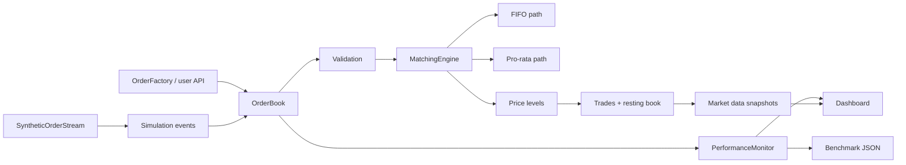

<p align="center">
  
</p>

<h1 align="center">tracebook</h1>

<p align="center">
  <strong>Latency-focused order book simulation with reproducible benchmarks, lifecycle events, and trace-level profiling hooks.</strong>
</p>

<p align="center">
  <a href="https://github.com/Taz33m/tracebook/actions/workflows/ci.yml"></a>
  <a href="LICENSE"></a>
  
  
  
  
</p>

> **TL;DR:** `tracebook` is an alpha Python market microstructure workbench for testing order book matching semantics, synthetic order flow, cancellations, replacements, benchmark latency, and profiling instrumentation. It is built for systems engineers and quant-minded developers who want inspectable behavior before making performance claims.

## Video Walkthrough

<p align="center">
  <a href="https://youtu.be/RXOcB2k7qTQ">
    
  </a>
</p>

Watch **Trace The Match** on YouTube: https://youtu.be/RXOcB2k7qTQ

## Best Way To Review

1. Run the unit tests and system smoke.
2. Execute a deterministic simulation with cancel and replace events.
3. Generate a benchmark JSON report with warmup excluded.
4. Launch the dashboard demo if you want live depth and performance telemetry.
5. Read the claims, non-claims, and limitations before treating any number as a production latency claim.

```bash
python -m pip install -e ".[dev,dashboard]"
python -m pytest
python test_system.py
tracebook-sim --duration 1 --throughput 50 --algorithm FIFO --seed 1337 --cancel-ratio 0.05 --replace-ratio 0.02 --warmup-seconds 0.01
tracebook-benchmark --scenario smoke --seed 1337 --warmup-seconds 0.01 --output benchmark_results/smoke.json
```

## Why This Matters

Order book projects are easy to overstate. A simulator can advertise high throughput while silently mixing order generation time into matching latency, ignoring cancellations, using only integer quantities, or skipping basic exchange-style order semantics.

`tracebook` takes the opposite path. It keeps the matching behavior explicit, separates generation and matching metrics, supports lifecycle events, validates incoming orders, and publishes benchmark output as reproducible local artifacts rather than universal performance claims.

The goal is a credible open-source alpha: small enough to audit, complete enough to demonstrate real mechanics, and honest enough that future optimization work has a stable baseline.

## Current Local Benchmark Snapshot

The sample below is a local smoke baseline, not a portable performance claim. It was measured on May 9, 2026 with Python 3.11.5 on macOS 15.4.1 using:

```bash
tracebook-benchmark --scenario all --duration 1 --throughput 100 --seed 2026 --warmup-seconds 0.05 --output /private/tmp/tracebook-benchmark-doc-baseline-current.json
```

| Scenario | Orders | Throughput ops/s | Mean ms | P50 ms | P95 ms | P99 ms | Generation mean ms | Event mean ms | Memory MB |
| --- | ---: | ---: | ---: | ---: | ---: | ---: | ---: | ---: | ---: |
| `smoke` | 100 | 99.93 | 2.922 | 0.060 | 0.219 | 3.186 | 0.855 | 0.000 | 134.28 |
| `fifo_baseline` | 110 | 109.98 | 0.139 | 0.112 | 0.363 | 0.512 | 1.181 | 0.000 | 134.31 |
| `pro_rata_baseline` | 100 | 99.93 | 0.124 | 0.095 | 0.398 | 0.630 | 0.868 | 0.000 | 134.19 |
| `cancellation_mix` | 112 | 111.53 | 0.130 | 0.087 | 0.369 | 0.590 | 1.752 | 0.036 | 100.03 |

See [`docs/performance.md`](docs/performance.md) before adding or changing benchmark claims.

## Current Artifact Proof

All checks below were run during the latest production repo pass in this checkout.

| Proof surface | Verified result |
| --- | --- |
| Unit tests | `115` pytest tests passing |
| System smoke | `python test_system.py` passes all 4 checks |
| Format and lint | `python -m black --check src tests examples install_deps.py` and `python -m flake8 src tests examples install_deps.py` report `0` issues |
| Type check | `python -m mypy src/tracebook/core` reports `0` issues |
| Compile and dependency checks | `python -m compileall -q src tests examples install_deps.py` and `python -m pip check` pass |
| Package build | sdist and wheel build successfully |
| Simulation CLI | deterministic FIFO smoke run completes |
| Benchmark CLI | smoke scenario writes JSON report |
| Dashboard loop | dashboard factory/import works, help completes, and local demo server returns `HTTP 200` on loopback |
| Remote CI | GitHub Actions passes on Python 3.10 and 3.11 |

## What It Implements

| Component | What it does | Why it matters |
| --- | --- | --- |
| FIFO matching | Matches resting orders by price-time priority | Provides the standard exchange-style baseline |
| Pro-rata matching | Allocates fills by resting size at a price level | Supports futures-style allocation experiments |
| Decimal quantities | Handles float quantities for crypto-style sizing | Avoids legacy integer-only simulator behavior |
| Order types | Supports limit, market, IOC, and FOK semantics | Covers common execution workflows |
| Lifecycle APIs | Cancels, replaces, active-order lookup, and structured `OrderResult` submissions | Makes simulations and demos inspectable |
| Self-trade prevention | Owner-tagged orders with `CANCEL_RESTING`/`CANCEL_INCOMING` policies | Stops a participant from matching its own resting liquidity |
| Event simulation | Interleaves `NEW`, `CANCEL`, and `REPLACE` events with deterministic seeds | Exercises more than one-way order ingestion |
| Synthetic streams | Generates random, trend, mean-reverting, momentum, passive, market-making, aggressive, and mixed flows | Enables repeatable workload variation |
| Performance monitor | Tracks throughput, latency, resources, generation time, event latency, and overhead | Separates signal from instrumentation cost |
| Benchmark runner | Runs fixed scenarios with warmup and machine metadata | Makes performance regression checks reproducible |
| Dashboard demo | Starts a Dash dashboard with optional background simulation | Gives a live review path without external services |
| CI and packaging | Tests, lint, smoke runs, benchmark smoke, dashboard smoke, and wheel/sdist build | Keeps the repo usable for contributors |

## Architecture



Core paths:

- `src/tracebook/core/order.py`: order, trade, side/type enums, and order factory.
- `src/tracebook/core/orderbook.py`: public book API, validation, lifecycle operations, callbacks, snapshots.
- `src/tracebook/core/matching_engine.py`: FIFO and pro-rata matching coordination.
- `src/tracebook/core/price_level.py`: price-level storage and depth snapshots.
- `src/tracebook/simulation/`: synthetic order streams and event-based simulation engine.
- `src/tracebook/benchmarks/runner.py`: reproducible benchmark scenarios and JSON reports.
- `src/tracebook/profiling/`: performance monitor and magic-trace/fallback profiling.
- `src/tracebook/visualization/dashboard.py`: Dash dashboard and demo simulation entry point.

See [`docs/architecture.md`](docs/architecture.md) for the deeper component map.

## Quick Start

Install locally:

```bash
git clone https://github.com/Taz33m/tracebook.git
cd tracebook
python -m venv venv
source venv/bin/activate
pip install -e ".[dev,dashboard]"
```

Run a minimal match:

```python
from tracebook import OrderBook, OrderSide

book = OrderBook("BTCUSD", matching_algorithm="fifo")

book.add_limit_order(OrderSide.BUY, price=50_000.0, quantity=1.0)
trades = book.add_limit_order(OrderSide.SELL, price=49_999.0, quantity=0.5)

for trade in trades:
    print(trade.quantity, trade.price)
```

Use structured result APIs when the caller needs lifecycle detail:

```python
from tracebook import OrderBook, OrderSide

book = OrderBook("BTCUSD")

result = book.submit_limit_order(OrderSide.BUY, price=49_950.0, quantity=0.25)

print(result.order.order_id)
print(result.rested)
print(result.cancelled)
print(result.rejected_reason)
```

## Order Lifecycle Example

```python
from tracebook import OrderBook, OrderSide

book = OrderBook("ETHUSD")

resting = book.submit_limit_order(OrderSide.BUY, price=3_000.0, quantity=2.0)
order_id = resting.order.order_id

print(book.get_active_order_ids())
print(book.get_order(order_id).remaining_quantity)

replacement = book.replace_order(order_id, price=3_001.0, quantity=1.5)
print(replacement.rested, replacement.rejected_reason)

cancelled = book.cancel_order(replacement.order.order_id)
print(cancelled)
```

## Simulation

Run a deterministic FIFO simulation with cancel and replace events:

```bash
tracebook-sim \
  --duration 5 \
  --throughput 500 \
  --algorithm FIFO \
  --seed 1337 \
  --cancel-ratio 0.05 \
  --replace-ratio 0.02 \
  --warmup-seconds 0.05 \
  --output benchmark_results/simulation.json
```

Run the pro-rata path:

```bash
tracebook-sim --duration 5 --throughput 500 --algorithm PRO_RATA --seed 1337
```

Enable magic-trace integration or fallback tracing:

```bash
tracebook-sim --duration 5 --throughput 500 --algorithm FIFO --magic-trace
```

## Self-Trade Prevention

Tag orders with an `owner` id and choose a policy so a participant never trades
against its own resting liquidity.

```python
from tracebook import OrderBook, OrderSide, SelfTradePolicy

book = OrderBook("BTCUSD", self_trade_policy=SelfTradePolicy.CANCEL_RESTING)

book.submit_limit_order(OrderSide.BUY, 100.0, 1.0, owner=1)   # own resting bid
book.submit_limit_order(OrderSide.BUY, 100.0, 1.0, owner=2)   # someone else
trades = book.add_limit_order(OrderSide.SELL, 100.0, 1.0, owner=1)

# Owner 1's sell skips its own bid and fills against owner 2 instead.
print(book.get_statistics()["self_trades_prevented"])  # 1
```

Policies (`SelfTradePolicy`):

| Policy | Behavior |
| --- | --- |
| `NONE` | Default; self-trades are allowed |
| `CANCEL_RESTING` | Cancel the same-owner resting order; the incoming order continues |
| `CANCEL_INCOMING` | Cancel the incoming order's remainder on contact with a same-owner order |

Orders without an owner (the default `NO_OWNER`) are anonymous and never
prevented. Both policies keep the book uncrossed, a FOK is not reported fillable
by its own liquidity, and the chosen policy is captured in the replay log.

## Record And Replay

Record every mutating operation on a book to a serializable event log, then
replay it against a fresh book to reconstruct the identical sequence of trades
and the identical final book state. This makes bug reproduction, regression
fixtures, and deterministic experiments trivial.

```python
from tracebook import OrderBook, OrderSide, EventLog, replay

book = OrderBook("BTCUSD")
log = book.start_recording()

book.add_limit_order(OrderSide.BUY, 50_000.0, 1.0)
book.add_limit_order(OrderSide.SELL, 49_999.0, 0.5)
book.stop_recording()

# Persist and restore across processes.
restored = EventLog.from_json(log.to_json())
rebuilt = replay(restored)

assert rebuilt.get_best_bid() == book.get_best_bid()
```

Matching does not depend on wall-clock time (execution price is the resting
price and FIFO priority is insertion order), so a fixed event log always
reproduces the same trades and resting book. Per-trade wall-clock timestamps are
metadata and are excluded from the determinism guarantee.

## Reproducible Benchmarks

```bash
tracebook-benchmark \
  --scenario all \
  --seed 1337 \
  --warmup-seconds 0.05 \
  --output benchmark_results/local.json
```

Scenarios:

| Scenario | Purpose |
| --- | --- |
| `smoke` | Short CI-friendly FIFO run |
| `fifo_baseline` | FIFO matching baseline |
| `pro_rata_baseline` | Pro-rata matching baseline |
| `cancellation_mix` | FIFO run with cancel and replace events |
| `all` | Runs every scenario above |

Benchmark JSON includes machine metadata, dependency versions, scenario config, seed, warmup, throughput, matching latency percentiles, generation latency, lifecycle event latency, memory, and monitoring overhead.

See [`docs/performance.md`](docs/performance.md) for local baseline guidance and sample measured results.

## Dashboard

```bash
tracebook-dashboard --port 8050 --demo-simulation --demo-throughput 200 --seed 1337
```

Open `http://localhost:8050` to inspect live throughput, latency, resource usage, trade volume, and book depth.
The dashboard binds to loopback by default; non-loopback hosts require `--allow-remote`
because the demo dashboard has no authentication.

Dashboard dependencies are optional:

```bash
pip install -e ".[dashboard]"
```

## Command Surface

| Command | Purpose |
| --- | --- |
| `tracebook-sim --duration 5 --throughput 500 --algorithm FIFO` | Run a FIFO simulation |
| `tracebook-sim --algorithm PRO_RATA --seed 1337` | Run the pro-rata path deterministically |
| `tracebook-sim --cancel-ratio 0.05 --replace-ratio 0.02` | Interleave lifecycle events |
| `tracebook-sim --output results.json` | Export simulation results |
| `tracebook-benchmark --scenario smoke` | Run the benchmark smoke scenario |
| `tracebook-benchmark --scenario all --output benchmark_results/local.json` | Produce a full local benchmark report |
| `tracebook-dashboard --demo-simulation` | Launch the dashboard with live demo data |
| `python -m pytest` | Run unit tests |
| `python test_system.py` | Run integration smoke checks |
| `python -m build --sdist --wheel --outdir dist` | Build package artifacts |

See [`docs/commands.md`](docs/commands.md) for CLI options and review workflows.

## Python API

```python
from tracebook import OrderBook, OrderBookManager, OrderSide

manager = OrderBookManager()
book = manager.create_order_book("BTCUSD", matching_algorithm="fifo")

book.submit_limit_order(OrderSide.BUY, 50_000.0, 1.0)
book.submit_limit_order(OrderSide.BUY, 49_950.0, 0.25)

result = book.submit_ioc_order(OrderSide.SELL, 49_900.0, 0.5)

print(len(result.trades))
print(book.get_best_bid())
print(book.get_best_ask())
print(book.get_order_book_depth(levels=3))
print(book.get_statistics())
```

Public top-level exports:

| Export | Purpose |
| --- | --- |
| `OrderBook` | Single-symbol order book |
| `OrderBookManager` | Multi-symbol book registry |
| `OrderFactory` | Explicit order construction |
| `OrderResult` | Structured submission result |
| `OrderSide` | `BUY` and `SELL` enum |
| `OrderType` | `MARKET`, `LIMIT`, `IOC`, `FOK` enum |
| `Trade` | Executed trade record |
| `SelfTradePolicy` | `NONE`, `CANCEL_RESTING`, `CANCEL_INCOMING` self-trade policy |
| `EventLog` | Serializable record of book operations for replay |
| `replay` | Reconstruct a book from a recorded `EventLog` |

## Outputs

| Output | Description |
| --- | --- |
| Simulation JSON | Raw simulation config, summary metrics, performance data, order book stats, stream stats, algorithm analysis |
| Benchmark JSON | Scenario summaries plus raw simulation results, machine metadata, dependency versions, warmup and seed |
| Dashboard charts | Throughput, latency, resources, trade volume, and depth |
| Performance docs | Local baseline samples and reporting rules |

Generated benchmark outputs and trace artifacts are ignored by git.

## Repository Layout

```text
src/tracebook/              package source
  core/                     orders, price levels, matching engine, order book API
  simulation/               synthetic order streams and event simulation
  benchmarks/               reproducible benchmark runner
  profiling/                performance monitor and tracing tools
  visualization/            Dash dashboard
tests/                      pytest correctness and integration coverage
docs/                       architecture, commands, and performance notes
examples/                   runnable example scripts
.github/workflows/          CI across supported Python versions
setup.py                    package metadata, extras, console scripts
pyproject.toml              build-system and tool configuration
```

## Claims And Non-Claims

Claims:

- Implements FIFO and pro-rata matching paths for supported order types.
- Supports decimal order quantities.
- Validates symbols, sides, order types, prices, and quantities before matching.
- Supports cancellation, replacement, active order lookup, and book-depth snapshots.
- Runs deterministic synthetic simulations with new, cancel, and replace events.
- Reports benchmark output with warmup, seed, machine metadata, generation timing, matching latency, event latency, memory, and monitoring overhead.
- Provides a dashboard demo path without requiring external market connectivity.

Non-claims:

- Not a production exchange matching engine.
- Not a trading venue, broker, market data vendor, or exchange connector.
- Not investment advice.
- Not a guarantee of live low-latency performance.
- Not a full fixed-point implementation yet; prices snap to an integer tick grid but quantities remain float64.
- Not a complete market microstructure research platform.
- Not proof that a listed benchmark number will reproduce on another machine.

## Limitations

- Alpha software; APIs may still evolve before a stable v1 release.
- Current storage uses plain Python dicts and lists (orders per level are an insertion-ordered dict; price levels are a bisect-indexed list), not a final low-latency memory layout.
- Prices snap to a configurable integer tick grid (`OrderBook(symbol, tick_size=...)`, default `0.01`); quantities remain float64 and full fixed-point accounting is a later performance phase.
- Synthetic order flow is useful for workload testing, not a substitute for real exchange data.
- Dashboard is a local demo and monitoring surface, not a secured production service.
- Magic-trace is optional and platform-dependent; fallback profiling is available when magic-trace is not installed.
- Benchmark results are local artifacts and should always cite the command, seed, machine, Python version, and dependency versions.

## Roadmap

Near-term production hardening:

- Expand the mypy type-check baseline beyond `core/` to the simulation, dashboard, and profiling modules.
- Expand benchmark scenarios for deeper book sweeps, multi-symbol runs, and higher cancellation mixes.
- Add more artifact-level tests around exported JSON schemas.
- Introduce fixed-point price and quantity experiments behind benchmark evidence.
- Publish release artifacts once the alpha API stabilizes.

## Open Source Project Health

- Contribution guide: [`CONTRIBUTING.md`](CONTRIBUTING.md)
- Security policy: [`SECURITY.md`](SECURITY.md)
- Code of conduct: [`CODE_OF_CONDUCT.md`](CODE_OF_CONDUCT.md)
- Support guide: [`SUPPORT.md`](SUPPORT.md)
- Changelog: [`CHANGELOG.md`](CHANGELOG.md)
- Project plan: [`PROJECT_PLAN.md`](PROJECT_PLAN.md)

Pull requests should include tests and should not add benchmark claims without a reproducible command and machine context.

## License

MIT License. See [`LICENSE`](LICENSE).
