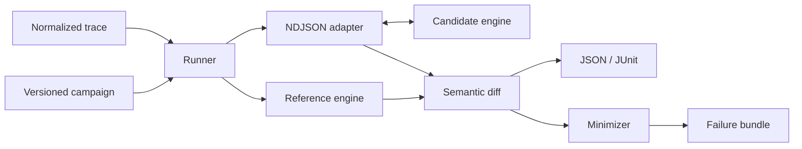

<p align="center">
  
</p>

<h1 align="center">Tracebook</h1>

<p align="center">
  <strong>Conformance testing and reproducible failure analysis for matching engines.</strong>
</p>

<p align="center">
  <a href="https://github.com/Taz33m/tracebook/actions/workflows/ci.yml"></a>
  <a href="https://pypi.org/project/tracebook-sim/"></a>
  <a href="https://pypi.org/project/tracebook-sim/"></a>
  <a href="https://github.com/Taz33m/tracebook/blob/main/LICENSE"></a>
</p>

Tracebook runs the same normalized order-lifecycle trace against an inspectable
reference engine and your Rust, C++, Java, Python, or other candidate. It stops
at the first semantic difference, explains what drifted, and reduces the
failure to a deterministic JSONL reproducer.

**Give it an engine. Get back the smallest trace that proves where it disagrees.**

[Quick start](#quick-start) · [Real failure](#a-real-four-event-rust-failure) ·
[Profiles](#portable-semantic-profiles) · [Adapters](#engine-adapters) ·
[CI](#continuous-integration) · [Architecture](#architecture)

## Quick Start

Tracebook requires Python 3.10-3.13. Install the public package and materialize
the hash-verified adversarial suite:

```bash
python -m pip install --upgrade tracebook-sim
tracebook-conformance sample ./tracebook-suite
tracebook-conformance --help
```

Those commands require only the published wheel. A candidate engine remains a
separate process by design. Once it speaks the
[versioned NDJSON protocol](https://github.com/Taz33m/tracebook/blob/main/docs/conformance.md),
run a deterministic campaign:

```bash
tracebook-conformance campaign \
  --profile fifo-limit-v1 \
  --seed 42 \
  --traces 25 \
  --events-per-trace 200 \
  --candidate-cmd './matching-engine --tracebook-stdio' \
  --corpus-dir .tracebook/corpus \
  --stop-after-first \
  --junit-output .tracebook/conformance.xml
```

Exit code `0` means every requested trace conformed. Exit code `1` means the
corpus contains the original failure, reduced reproducer, semantic diff,
coverage evidence, campaign metadata, and JUnit result.

For a working adapter before writing your own, use the
[native orderbook-rs walkthrough](https://github.com/Taz33m/tracebook/tree/main/integrations/orderbook_rs)
or the smaller
[Python process example](https://github.com/Taz33m/tracebook/blob/main/examples/conformance_adapter.py).

## A Real Four-Event Rust Failure

[Flash's matching-engine benchmark](https://github.com/flash1-dev/matching-engine-benchmark)
reported a historical FIFO defect in an `orderbook-rs` dependency: after a
partial fill, the oldest maker's remainder moved behind a later maker at the
same price. Upstream tracked the defect as
[`orderbook-rs` #88](https://github.com/joaquinbejar/OrderBook-rs/issues/88)
and fixed it in
[`PR #131`](https://github.com/joaquinbejar/OrderBook-rs/pull/131).

On `main`, Tracebook runs the exact affected revision and the current fixed
engine through the same native adapter. Seed `42` generates the first incorrect trade at event
`173`; deterministic delta debugging reduces the lifecycle history to four
events while preserving the same maker-ID mismatch.

<p align="center">
  
</p>

The reduced trace then becomes an ordinary CI regression: it must reproduce
against the affected revision and pass against `orderbook-rs` `0.11.0`.

- [Read the provenance and reduction case study](https://github.com/Taz33m/tracebook/blob/main/docs/case-studies/orderbook-rs-issue-88.md)
- [Inspect the four-event JSONL reproducer](https://github.com/Taz33m/tracebook/blob/main/integrations/orderbook_rs/regressions/issue-88-reduced.jsonl)
- [Review the native Rust adapter](https://github.com/Taz33m/tracebook/tree/main/integrations/orderbook_rs/src)

This is a retrospective import of a defect Flash discovered, not a Tracebook
discovery claim. The value Tracebook adds is deterministic generation,
first-divergence localization, minimization, replay, and a reusable regression
artifact.

## What It Compares

| Surface | Comparison |
| --- | --- |
| Outcomes | Applied or rejected status plus stable rejection reason |
| Trades | Ordered maker/taker source IDs, side, price, and quantity |
| Resting state | Full price-time queue order, remaining quantity, owner, and symbol |
| Lifecycle | New, cancel, reduce, replace, clear, duplicate, and inactive requests |
| Instructions | Limit, market, IOC, FOK, and configured self-trade prevention |
| Isolation | Independent multi-symbol books and canonical state hashes |
| Evidence | Candidate-independent semantic coverage for compared events |

Tracebook transfers compact observations after each event and requests a full
queue snapshot only at divergence and completion. Candidate execution time is
not presented as engine latency because it includes process, serialization, and
adapter overhead.

## Portable Semantic Profiles

Profiles are versioned contracts. Existing names do not silently acquire new
behavior, so seeds and campaign hashes remain reproducible.

| Profile | Contract |
| --- | --- |
| `fifo-limit-v1` | FIFO limit orders, partial fills, cancel, reduce, replace, clear, duplicates, inactive requests, and multiple symbols |
| `fifo-full-v1` | `fifo-limit-v1` plus market, IOC, and FOK instructions |
| `fifo-partial-fill-v1` | Portable FIFO lifecycle plus the real partial-fill continuation probe |
| Standard suite v1 | Eight adversarial fixtures covering FIFO, instructions, STP, tick grids, deep cancellation, multiple symbols, and pro-rata |

Campaigns use specified SplitMix64 trace seeds and candidate-independent
generation. Reports distinguish semantic workload coverage from Python source
coverage.

[Read the profile, protocol, hashing, and minimizer contracts](https://github.com/Taz33m/tracebook/blob/main/docs/conformance.md).

## Architecture



The process boundary keeps the candidate independent of Tracebook's Python
implementation. Adapters translate only between native engine operations and
the canonical protocol.

[Open the detailed component map](https://github.com/Taz33m/tracebook/blob/main/docs/architecture.md).

## Engine Adapters

| Candidate | Native surface | Evidence |
| --- | --- | --- |
| [`orderbook-rs` 0.11.0](https://github.com/Taz33m/tracebook/tree/main/integrations/orderbook_rs) | Rust FIFO lifecycle, market/IOC/FOK, STP, deterministic trade IDs, full queue snapshots | Conformant generated FIFO campaign; `7/8` standard cases with pro-rata explicitly unsupported; semantics reviewed in [upstream issue #203](https://github.com/joaquinbejar/OrderBook-rs/issues/203) |
| Historical `orderbook-rs` issue #88 | Exact affected Rust dependency behind an opt-in Cargo feature | Event `173` localized and reduced to the committed four-event regression |
| `faulty-orderbook-adapter` | Real Rust engine plus one documented injected queue-priority fault | Synthetic negative control reduced from event `173` to five causal events |
| [PythonMatchingEngine](https://github.com/Taz33m/tracebook/tree/main/integrations/python_matching_engine) | Pinned FIFO limit lifecycle, cancellation, reduction, replacement, clear, and queue snapshots | Compatible trace passes; unsupported instructions, STP, tick grid, and pro-rata remain visible differences |
| Your engine | Any language that can read and write newline-delimited JSON | Start from the [adapter contract](https://github.com/Taz33m/tracebook/blob/main/docs/conformance.md) and gate only the profile your engine claims |

A divergence means two configured contracts disagree. It does not, by itself,
declare either project incorrect.

## Failure Artifacts

Every stopped campaign writes an atomic, content-addressed bundle:

| Artifact | Purpose |
| --- | --- |
| `campaign.json` | Seed, profile, generator version, trace count, campaign hash, and coverage |
| `failure.json` | Failure class, exact semantic path, engines, IDs, and reproduction expectation |
| `original.jsonl` | Complete generated history through the first divergence |
| `reduced.jsonl` | Deterministic minimized reproducer |
| `minimization.json` | Run budget, reduction evidence, and one-minimal status |
| JUnit XML | Native pull-request annotation and test-report ingestion |

Replay a stored expectation without regenerating anything:

```bash
tracebook-conformance reproduce \
  .tracebook/corpus/<failure-id>/reduced.jsonl \
  --candidate-cmd './matching-engine --tracebook-stdio'
```

## Continuous Integration

This minimal job installs the public PyPI release. Replace only the candidate
build and command:

```yaml
name: Matching engine conformance

on: [pull_request]

jobs:
  conformance:
    runs-on: ubuntu-latest
    steps:
      - uses: actions/checkout@v7
      - uses: actions/setup-python@v6
        with:
          python-version: "3.12"
      - run: python -m pip install "tracebook-sim==0.4.1"
      - run: make build
      - run: |
          tracebook-conformance campaign \
            --profile fifo-limit-v1 \
            --seed 42 \
            --traces 25 \
            --events-per-trace 200 \
            --candidate-cmd './build/matching-engine --tracebook-stdio' \
            --corpus-dir artifacts/corpus \
            --stop-after-first \
            --junit-output artifacts/conformance.xml
```

The repository includes a
[copy-paste workflow with artifact upload](https://github.com/Taz33m/tracebook/blob/main/examples/github-actions/conformance.yml)
and a short
[CI integration guide](https://github.com/Taz33m/tracebook/blob/main/docs/ci.md).

## Reference Semantics

The bundled Python engine is intentionally small and inspectable. It supports:

- FIFO and pro-rata allocation;
- limit, market, IOC, and FOK orders;
- cancellation, priority-preserving reduction, and priority-losing replacement;
- configurable self-trade prevention;
- detached queue snapshots and deterministic record/replay;
- stable structured outcomes for validation and lifecycle failures.

It is the executable oracle for declared Tracebook profiles, not a production
exchange engine.

## Additional Workbench Tools

The conformance wedge sits on top of useful lower-level tooling rather than
removing it:

| Tool | Use |
| --- | --- |
| [Normalized event replay](https://github.com/Taz33m/tracebook/blob/main/docs/event-replay.md) | Replay CSV, JSON, or JSONL lifecycle streams with source-ID preservation |
| [Coinbase Exchange L3](https://github.com/Taz33m/tracebook/blob/main/docs/coinbase-l3.md) | Validate snapshot/feed sequence and normalize public Level 3 messages |
| [Verified corpora](https://github.com/Taz33m/tracebook/blob/main/docs/corpora.md) | Bind local datasets to manifests, golden states, and reproducible import benchmarks |
| [Performance reports](https://github.com/Taz33m/tracebook/blob/main/docs/performance.md) | Separate generation, matching, lifecycle, memory, and monitoring measurements |
| Local dashboard | Inspect simulation and profiling artifacts without a hosted service |

These tools support correctness investigations. Tracebook does not claim that
local Python timings predict production Rust or C++ latency.

## Project Boundaries

Tracebook is not:

- a production exchange or broker gateway;
- a complete strategy backtester or portfolio platform;
- a realistic multi-agent market economy;
- a source of redistributable exchange data;
- a universal performance ranking for matching engines.

[Read the product position and comparison with adjacent projects](https://github.com/Taz33m/tracebook/blob/main/docs/positioning.md).

## Contributing

Tracebook supports Python 3.10 through 3.13 and is alpha software. The real
four-event `orderbook-rs` case study currently requires a source checkout.

```bash
git clone https://github.com/Taz33m/tracebook.git
cd tracebook
python -m venv venv
source venv/bin/activate
python -m pip install -e ".[dev,dashboard]"
make quality
```

Start with the
[contribution guide](https://github.com/Taz33m/tracebook/blob/main/CONTRIBUTING.md),
the [command reference](https://github.com/Taz33m/tracebook/blob/main/docs/commands.md),
or an [issue](https://github.com/Taz33m/tracebook/issues). Security reports follow
the private process in
[`SECURITY.md`](https://github.com/Taz33m/tracebook/blob/main/SECURITY.md).

## License

[MIT](https://github.com/Taz33m/tracebook/blob/main/LICENSE)
