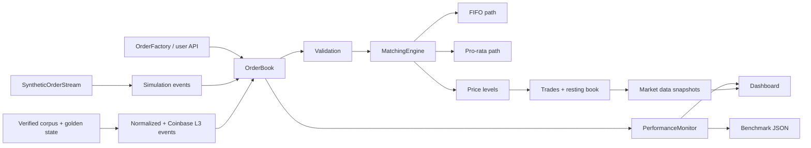

<p align="center">
  
</p>

<h1 align="center">tracebook</h1>

<p align="center">
  <strong>Inspectable order-book semantics, normalized event replay, paced benchmarks, and trace-level profiling.</strong>
</p>

<p align="center">
  <a href="https://github.com/Taz33m/tracebook/actions/workflows/ci.yml"></a>
  <a href="LICENSE"></a>
  
  
  
  
</p>

> **TL;DR:** `tracebook` is an alpha Python market microstructure workbench for testing matching semantics, replaying normalized historical order events, generating synthetic flow, and measuring local latency with explicit boundaries. It is built for systems engineers and quant-minded developers who want inspectable behavior before making performance claims.

## Video Walkthrough

<p align="center">
  <a href="https://youtu.be/RXOcB2k7qTQ">
    
  </a>
</p>

Watch **Trace The Match** on YouTube: https://youtu.be/RXOcB2k7qTQ

## Best Way To Review

1. Run the unit tests and system smoke.
2. Execute a deterministic simulation with cancel and replace events.
3. Generate a benchmark JSON report with warmup excluded.
4. Verify the checked Coinbase corpus and its deterministic golden state.
5. Launch the dashboard demo if you want live depth and performance telemetry.
6. Read the claims, non-claims, and limitations before treating any number as a production latency claim.

```bash
python -m pip install -e ".[dev,dashboard]"
python -m pytest
python test_system.py
tracebook-replay examples/data/sample_events.jsonl --output /tmp/tracebook-replay.json
tracebook-coinbase examples/data/coinbase_btcusd_l3_snapshot.json examples/data/coinbase_btcusd_full.jsonl --tick-size 0.01 --output /tmp/tracebook-coinbase.json
tracebook-corpus sample /tmp/tracebook-sample-corpus
tracebook-corpus verify /tmp/tracebook-sample-corpus
tracebook-sim --duration 1 --throughput 50 --algorithm FIFO --seed 1337 --cancel-ratio 0.05 --replace-ratio 0.02 --warmup-seconds 0.01
tracebook-benchmark --scenario smoke --seed 1337 --warmup-seconds 0.01 --output benchmark_results/smoke.json
```

## Why This Matters

Order book projects are easy to overstate. A simulator can advertise high throughput while silently mixing order generation time into matching latency, ignoring cancellations, using only integer quantities, or skipping basic exchange-style order semantics.

`tracebook` takes the opposite path. It keeps the matching behavior explicit, separates generation and matching metrics, supports lifecycle events, validates incoming orders, and publishes benchmark output as reproducible local artifacts rather than universal performance claims.

The goal is a credible open-source alpha: small enough to audit, complete enough to demonstrate real mechanics, and honest enough that future optimization work has a stable baseline.

## Current Local Benchmark Snapshot

The sample below is a local paced-workload baseline, not a portable performance
or capacity claim. It was measured for 0.2.0 on July 10, 2026 with Python 3.10.5
on macOS 15.4.1 using:

```bash
tracebook-benchmark --scenario all --duration 1 --throughput 100 --seed 2026 --warmup-seconds 0.05 --output /tmp/tracebook-v020-baseline.json
```

| Scenario | New | New/s | Events/s | Mean ms | P95 ms | P99 ms | Generation ms | Event ms | Memory MB |
| --- | ---: | ---: | ---: | ---: | ---: | ---: | ---: | ---: | ---: |
| `smoke` | 100 | 99.91 | 99.91 | 0.045 | 0.095 | 0.119 | 0.282 | 0.000 | 34.38 |
| `fifo_baseline` | 110 | 109.91 | 109.91 | 0.040 | 0.081 | 0.093 | 0.260 | 0.000 | 35.62 |
| `pro_rata_baseline` | 100 | 99.92 | 99.92 | 0.041 | 0.092 | 0.105 | 0.268 | 0.000 | 35.67 |
| `cancellation_mix` | 100 | 99.91 | 109.90 | 0.041 | 0.089 | 0.112 | 0.287 | 0.017 | 36.00 |
| `deep_book` | 100 | 99.96 | 99.96 | 0.051 | 0.120 | 0.200 | 0.381 | 0.000 | 36.23 |
| `high_cancellation` | 100 | 99.88 | 147.82 | 0.040 | 0.084 | 0.147 | 0.259 | 0.016 | 36.45 |
| `pro_rata_cancellation` | 100 | 99.97 | 115.97 | 0.052 | 0.125 | 0.233 | 0.431 | 0.021 | 36.69 |
| `multi_symbol` | 108 | 107.92 | 107.92 | 0.043 | 0.080 | 0.118 | 0.135 | 0.000 | 36.92 |

See [`docs/performance.md`](docs/performance.md) before adding or changing benchmark claims.

## Current Artifact Proof

All checks below were run during the latest production repo pass in this checkout.

| Proof surface | Verified result |
| --- | --- |
| Unit tests | `238` pytest tests passing with `78.51%` statement coverage and a `75%` gate |
| System smoke | `python test_system.py` passes all 5 checks |
| Format and lint | Black and Flake8 cover package, tests, examples, and smoke tooling with `0` issues |
| Type check | `python -m mypy src/tracebook` reports `0` issues |
| Compile and dependency checks | `python -m compileall -q src tests examples install_deps.py` and `python -m pip check` pass |
| Package build | sdist and wheel build successfully |
| Simulation CLI | deterministic FIFO smoke run completes |
| Benchmark CLI | smoke scenario writes JSON report |
| Dashboard loop | dashboard factory/import works, help completes, and local demo server returns `HTTP 200` on loopback |
| Remote CI | GitHub Actions covers Python 3.10 through 3.13 |

## What It Implements

| Component | What it does | Why it matters |
| --- | --- | --- |
| FIFO matching | Matches resting orders by price-time priority | Provides the standard exchange-style baseline |
| Pro-rata matching | Allocates fills by resting size at a price level | Supports futures-style allocation experiments |
| Decimal quantities | Handles float quantities for crypto-style sizing | Avoids legacy integer-only simulator behavior |
| Order types | Supports limit, market, IOC, and FOK semantics | Covers common execution workflows |
| Lifecycle APIs | Cancels, priority-preserving quantity reductions, replaces, active-order lookup, and structured `OrderResult` submissions | Makes simulations and imported books inspectable |
| Self-trade prevention | Owner-tagged orders with `CANCEL_RESTING`/`CANCEL_INCOMING` policies | Stops a participant from matching its own resting liquidity |
| Historical event replay | Loads normalized CSV, JSON, and JSONL order events across symbols while preserving source ids through replacement | Connects real feed adapters to the validated matching path |
| Coinbase Exchange L3 adapter | Streams REST L3 snapshots plus recorded `full`/compact `level3` messages with sequence validation | Provides one concrete, auditable path from venue data to normalized events |
| Verified market-data corpora | Captures or prepares sanitized local sessions with SHA-256 manifests, canonical events, deterministic golden state, and comparable import benchmarks | Makes adapter correctness and performance independently reproducible |
| Detached public state | Returns copies from submission, lookup, trade, and callback APIs | Prevents callers from mutating live engine indexes |
| Event simulation | Interleaves `NEW`, `CANCEL`, and `REPLACE` events with deterministic seeds | Exercises more than one-way order ingestion |
| Synthetic streams | Generates random, trend, mean-reverting, momentum, passive, market-making, aggressive, and mixed flows | Enables repeatable workload variation |
| Performance monitor | Tracks throughput, latency, resources, generation time, event latency, and overhead | Separates signal from instrumentation cost |
| Benchmark runner | Runs fixed scenarios with warmup and machine metadata | Makes performance regression checks reproducible |
| Dashboard demo | Starts a Dash dashboard with optional background simulation | Gives a live review path without external services |
| Web frontend | Dependency-free static live order-book UI over a stdlib server | A clean live view with no Dash/JS-build dependencies |
| CI and packaging | Tests, lint, smoke runs, benchmark smoke, dashboard smoke, and wheel/sdist build | Keeps the repo usable for contributors |

## Architecture



Core paths:

- `src/tracebook/core/order.py`: order, trade, side/type enums, and order factory.
- `src/tracebook/core/orderbook.py`: public book API, validation, lifecycle operations, callbacks, snapshots.
- `src/tracebook/core/matching_engine.py`: FIFO and pro-rata matching coordination.
- `src/tracebook/core/price_level.py`: price-level storage and depth snapshots.
- `src/tracebook/events/`: normalized event replay and Coinbase Exchange L3 adaptation.
- `src/tracebook/corpus/`: safe local capture, corpus manifests, golden verification, and corpus benchmarks.
- `src/tracebook/simulation/`: synthetic order streams and event-based simulation engine.
- `src/tracebook/benchmarks/runner.py`: reproducible benchmark scenarios and JSON reports.
- `src/tracebook/profiling/`: performance monitor and magic-trace/fallback profiling.
- `src/tracebook/visualization/dashboard.py`: Dash dashboard and demo simulation entry point.

See [`docs/architecture.md`](docs/architecture.md) for the deeper component map.

## Quick Start

Install the published distribution (the import remains `tracebook`):

```bash
python -m pip install tracebook-sim
```

Contributor install:

```bash
git clone https://github.com/Taz33m/tracebook.git
cd tracebook
python -m venv venv
source venv/bin/activate
python -m pip install -e ".[dev,dashboard]"
```

Run a minimal match:

```python
from tracebook import OrderBook, OrderSide

book = OrderBook("BTCUSD", matching_algorithm="fifo")

book.add_limit_order(OrderSide.BUY, price=50_000.0, quantity=1.0)
trades = book.add_limit_order(OrderSide.SELL, price=49_999.0, quantity=0.5)

for trade in trades:
    print(trade.quantity, trade.price)
```

Use structured result APIs when the caller needs lifecycle detail:

```python
from tracebook import OrderBook, OrderSide

book = OrderBook("BTCUSD")

result = book.submit_limit_order(OrderSide.BUY, price=49_950.0, quantity=0.25)

print(result.order.order_id)
print(result.rested)
print(result.cancelled)
print(result.rejected_reason)
```

## Order Lifecycle Example

```python
from tracebook import OrderBook, OrderSide

book = OrderBook("ETHUSD")

resting = book.submit_limit_order(OrderSide.BUY, price=3_000.0, quantity=2.0)
order_id = resting.order.order_id

print(book.get_active_order_ids())
print(book.get_order(order_id).remaining_quantity)

replacement = book.replace_order(order_id, price=3_001.0, quantity=1.5)
print(replacement.rested, replacement.rejected_reason)

cancelled = book.cancel_order(replacement.order.order_id)
print(cancelled)
```

## Simulation

Run a deterministic FIFO simulation with cancel and replace events:

```bash
tracebook-sim \
  --duration 5 \
  --throughput 500 \
  --algorithm FIFO \
  --seed 1337 \
  --cancel-ratio 0.05 \
  --replace-ratio 0.02 \
  --warmup-seconds 0.05 \
  --output benchmark_results/simulation.json
```

Run the pro-rata path:

```bash
tracebook-sim --duration 5 --throughput 500 --algorithm PRO_RATA --seed 1337
```

Enable magic-trace integration or fallback tracing:

```bash
tracebook-sim --duration 5 --throughput 500 --algorithm FIFO --magic-trace
```

## Self-Trade Prevention

Tag orders with an `owner` id and choose a policy so a participant never trades
against its own resting liquidity.

```python
from tracebook import OrderBook, OrderSide, SelfTradePolicy

book = OrderBook("BTCUSD", self_trade_policy=SelfTradePolicy.CANCEL_RESTING)

book.submit_limit_order(OrderSide.BUY, 100.0, 1.0, owner=1)   # own resting bid
book.submit_limit_order(OrderSide.BUY, 100.0, 1.0, owner=2)   # someone else
trades = book.add_limit_order(OrderSide.SELL, 100.0, 1.0, owner=1)

# Owner 1's sell skips its own bid and fills against owner 2 instead.
print(book.get_statistics()["self_trades_prevented"])  # 1
```

Policies (`SelfTradePolicy`):

| Policy | Behavior |
| --- | --- |
| `NONE` | Default; self-trades are allowed |
| `CANCEL_RESTING` | Cancel the same-owner resting order; the incoming order continues |
| `CANCEL_INCOMING` | Cancel the incoming order's remainder on contact with a same-owner order |

Orders without an owner (the default `NO_OWNER`) are anonymous and never
prevented. Both policies keep the book uncrossed, a FOK is not reported fillable
by its own liquidity, and the chosen policy is captured in the replay log.

## Record And Replay

Record every accepted submission, successful cancellation, and full clear to a serializable event log, then
replay it against a fresh book to reconstruct the identical sequence of trades
and the identical final book state. This makes bug reproduction, regression
fixtures, and deterministic experiments trivial.

```python
from tracebook import OrderBook, OrderSide, EventLog, replay

book = OrderBook("BTCUSD")
log = book.start_recording()

book.add_limit_order(OrderSide.BUY, 50_000.0, 1.0)
book.add_limit_order(OrderSide.SELL, 49_999.0, 0.5)
book.stop_recording()

# Persist and restore across processes.
restored = EventLog.from_json(log.to_json())
rebuilt = replay(restored)

assert rebuilt.get_best_bid() == book.get_best_bid()
```

Matching does not depend on wall-clock time (execution price is the resting
price and FIFO priority is insertion order), so a fixed event log always
reproduces the same trades and resting book. Per-trade wall-clock timestamps are
metadata and are excluded from the determinism guarantee.

Recording must begin on a pristine book: the log captures only operations from
the `start_recording()` call onward, so `start_recording()` raises after any
prior activity. Call `clear()` before recording a previously used book.

## Historical Order-Event Replay

Replay normalized order-level data through the same validated books used by the
Python API. Input can be CSV, JSON, or JSONL and can contain multiple symbols.

```bash
tracebook-replay examples/data/sample_events.jsonl \
  --algorithm fifo \
  --self-trade-policy CANCEL_INCOMING \
  --include-trades \
  --output replay-summary.json
```

Strict mode fails at the first rejected event with its file-order index. Add
`--lenient` to collect rejections and continue. Source order ids remain
addressable after cancel-and-new replacement; optional trade output includes
both source and engine ids. See
[`docs/event-replay.md`](docs/event-replay.md) for the schema and adapter guidance.

### Coinbase Exchange L3

Normalize and replay the included Coinbase-style REST L3 snapshot and recorded
`full` feed without adding a network or authentication dependency:

```bash
tracebook-coinbase \
  examples/data/coinbase_btcusd_l3_snapshot.json \
  examples/data/coinbase_btcusd_full.jsonl \
  --tick-size 0.01 \
  --events-output /tmp/coinbase-events.jsonl \
  --include-trades \
  --output /tmp/coinbase-replay.json
```

The adapter enforces per-product sequence continuity, parses the compact
channel's announced schema, preserves maker reductions without resetting FIFO
priority, and keeps observed exchange trades separate from simulated trades.
See [`docs/coinbase-l3.md`](docs/coinbase-l3.md) for synchronization and
limitations.

### Verified Coinbase Corpora

The checked synthetic corpus binds sanitized source input, normalized events,
and complete final depth to one stable SHA-256 identity:

```bash
tracebook-corpus sample /tmp/tracebook-sample-corpus
tracebook-corpus verify /tmp/tracebook-sample-corpus

tracebook-corpus benchmark \
  /tmp/tracebook-sample-corpus \
  --iterations 10 \
  --warmups 2 \
  --output benchmark_results/corpus.json
```

Optional live capture subscribes before taking one REST L3 snapshot, sanitizes
before disk, and never accepts credentials. Coinbase's market-data terms may
restrict redistribution, so live manifests say `redistribution=not_granted`
and the root `corpora/` directory is ignored by Git. Install
`tracebook-sim[capture]` and review [`docs/corpora.md`](docs/corpora.md) before
capturing.

## Reproducible Paced Workloads

```bash
tracebook-benchmark \
  --scenario all \
  --seed 1337 \
  --warmup-seconds 0.05 \
  --output benchmark_results/local.json
```

Scenarios:

| Scenario | Purpose |
| --- | --- |
| `smoke` | Short CI-friendly FIFO run |
| `fifo_baseline` | FIFO matching baseline |
| `pro_rata_baseline` | Pro-rata matching baseline |
| `cancellation_mix` | FIFO run with cancel and replace events |
| `deep_book` | Higher-throughput FIFO run that builds deep resting liquidity |
| `high_cancellation` | FIFO run with a heavier cancel/replace mix |
| `pro_rata_cancellation` | Pro-rata run with cancel and replace events |
| `multi_symbol` | FIFO run across multiple symbols (independent books) |
| `all` | Runs every scenario above |

These scenarios drive a configured input rate and measure latency under that
load; they are not maximum-capacity claims. Benchmark JSON includes machine
metadata, dependency versions, scenario config, seed, warmup, achieved new-order
and event rates, matching latency percentiles, generation latency, lifecycle
event latency, memory, and monitoring overhead.

See [`docs/performance.md`](docs/performance.md) for local baseline guidance and sample measured results.

## Dashboard

```bash
tracebook-dashboard --port 8050 --demo-simulation --demo-throughput 200 --seed 1337
```

Open `http://localhost:8050` to inspect live throughput, latency, resource usage, trade volume, and book depth.
The dashboard binds to loopback by default; non-loopback hosts require `--allow-remote`
because the demo dashboard has no authentication.

Dashboard dependencies are optional:

```bash
python -m pip install "tracebook-sim[dashboard]"
```

## Live Web Frontend

A dependency-free live order-book frontend: a static HTML/CSS/JS page served by a
stdlib HTTP server, backed by a background simulation. No Dash, no build step, no
extras — it ships with the core package.

```bash
tracebook-web --port 8080 --throughput 500 --seed 1337
```

Open `http://localhost:8080` for a live depth ladder, top-of-book quote,
throughput and latency metrics, and a trade tape. The page polls `/api/state`
(a JSON snapshot) a couple of times a second. Like the dashboard it is
unauthenticated, so it binds to loopback by default and a non-loopback host
requires `--allow-remote`.

## Command Surface

| Command | Purpose |
| --- | --- |
| `tracebook-sim --duration 5 --throughput 500 --algorithm FIFO` | Run a FIFO simulation |
| `tracebook-sim --algorithm PRO_RATA --seed 1337` | Run the pro-rata path deterministically |
| `tracebook-sim --cancel-ratio 0.05 --replace-ratio 0.02` | Interleave lifecycle events |
| `tracebook-sim --output results.json` | Export simulation results |
| `tracebook-benchmark --scenario smoke` | Run the benchmark smoke scenario |
| `tracebook-benchmark --scenario all --output benchmark_results/local.json` | Produce a full local benchmark report |
| `tracebook-replay events.jsonl --output replay.json` | Replay normalized historical order events |
| `tracebook-coinbase snapshot.json full.jsonl --tick-size 0.01` | Normalize and replay Coinbase Exchange L3 data |
| `tracebook-corpus verify corpus/` | Verify hashes, events, and deterministic golden state |
| `tracebook-corpus benchmark corpus/ --output report.json` | Measure corpus import and replay phases |
| `tracebook-dashboard --demo-simulation` | Launch the Dash dashboard with live demo data |
| `tracebook-web --port 8080` | Serve the dependency-free live order-book frontend |
| `python -m pytest` | Run unit tests |
| `python test_system.py` | Run integration smoke checks |
| `python -m build --sdist --wheel --outdir dist` | Build package artifacts |

See [`docs/commands.md`](docs/commands.md) for CLI options and review workflows.

## Python API

```python
from tracebook import OrderBook, OrderBookManager, OrderSide

manager = OrderBookManager()
book = manager.create_order_book("BTCUSD", matching_algorithm="fifo")

book.submit_limit_order(OrderSide.BUY, 50_000.0, 1.0)
book.submit_limit_order(OrderSide.BUY, 49_950.0, 0.25)

result = book.submit_ioc_order(OrderSide.SELL, 49_900.0, 0.5)

print(len(result.trades))
print(book.get_best_bid())
print(book.get_best_ask())
print(book.get_order_book_depth(levels=3))
print(book.get_statistics())
```

Public top-level exports:

| Export | Purpose |
| --- | --- |
| `OrderBook` | Single-symbol order book |
| `OrderBookManager` | Multi-symbol book registry |
| `Order` | Explicit external order representation |
| `OrderFactory` | Explicit order construction |
| `OrderResult` | Structured submission result |
| `OrderSide` | `BUY` and `SELL` enum |
| `OrderType` | `MARKET`, `LIMIT`, `IOC`, `FOK` enum |
| `Trade` | Executed trade record |
| `SelfTradePolicy` | `NONE`, `CANCEL_RESTING`, `CANCEL_INCOMING` self-trade policy |
| `EventLog` | Serializable record of book operations for replay |
| `replay` | Reconstruct a book from a recorded `EventLog` |
| `MarketEvent` | Validated normalized historical order event |
| `MarketReplayResult` | Reconstructed books, source-id mapping, trades, and rejections |
| `ReplayTrade` | Trade record annotated with source and engine order ids |
| `load_market_events` | Load CSV, JSON, or JSONL event files |
| `replay_market_events` | Replay normalized events into per-symbol books |

## Outputs

| Output | Description |
| --- | --- |
| Simulation JSON | Raw simulation config, summary metrics, performance data, order book stats, stream stats, algorithm analysis |
| Benchmark JSON | Scenario summaries plus raw simulation results, machine metadata, dependency versions, warmup and seed |
| Event replay JSON | Config, applied/rejected counts, active source-id mapping, final depth, per-book statistics, and optional trades |
| Corpus manifest and golden JSON | Source rights, sanitization/capture metadata, file hashes, canonical event digest, sequence range, and complete final depth |
| Corpus benchmark/comparison JSON | Raw timing samples, machine/dependency metadata, corpus identity, phase summaries, and explicit environment differences |
| Dashboard charts | Throughput, latency, resources, trade volume, and depth |
| Performance docs | Local baseline samples and reporting rules |

Generated benchmark outputs and trace artifacts are ignored by git.

## Repository Layout

```text
src/tracebook/              package source
  core/                     orders, price levels, matching engine, order book API
  events/                   normalized file loading and historical event replay
  corpus/                   capture, manifests, bundled fixture, verification, benchmarks
  simulation/               synthetic order streams and event simulation
  benchmarks/               reproducible benchmark runner
  profiling/                performance monitor and tracing tools
  visualization/            Dash dashboard + static web frontend (web/)
tests/                      pytest correctness and integration coverage
docs/                       architecture, commands, and performance notes
examples/                   runnable example scripts and source feed fixtures
.github/workflows/          CI across supported Python versions
setup.py                    package metadata, extras, console scripts
pyproject.toml              build-system and tool configuration
```

## Claims And Non-Claims

Claims:

- Implements FIFO and pro-rata matching paths for supported order types.
- Supports decimal order quantities.
- Validates symbols, sides, order types, prices, and quantities before matching.
- Supports atomic replacement, cancellation, detached active-order lookup, and coherent state snapshots.
- Replays normalized CSV, JSON, and JSONL order events across independent symbol books with stable source-id lifecycle mapping.
- Verifies hash-locked corpus inputs by reproducing canonical events and golden final book state exactly.
- Runs deterministic synthetic simulations with new, cancel, and replace events.
- Reports benchmark output with warmup, seed, machine metadata, generation timing, matching latency, event latency, memory, and monitoring overhead.
- Provides a dashboard demo path without requiring external market connectivity.

Non-claims:

- Not a production exchange matching engine.
- Not a trading venue, broker, production feed handler, or market-data vendor.
- Not a grant of rights to redistribute captured exchange market data.
- Not investment advice.
- Not a guarantee of live low-latency performance.
- Not a full fixed-point implementation yet; prices snap to an integer tick grid but quantities remain float64.
- Not a complete market microstructure research platform.
- Not proof that a listed benchmark number will reproduce on another machine.

## Limitations

- Alpha software; APIs may still evolve before a stable v1 release.
- Current storage uses plain Python dicts and lists (orders per level are an insertion-ordered dict; price levels are a bisect-indexed list), not a final low-latency memory layout.
- Prices snap to a configurable integer tick grid (`OrderBook(symbol, tick_size=...)`, default `0.01`); quantities remain float64 and full fixed-point accounting is a later performance phase.
- The normalized replay contract is venue-neutral; exchange sequence checks and feed-specific semantics belong in adapters.
- Live Coinbase corpora are local artifacts. Pseudonymization removes unnecessary identifiers but does not alter Coinbase's market-data terms.
- Dashboard is a local demo and monitoring surface, not a secured production service.
- Magic-trace is optional and platform-dependent; fallback profiling is available when magic-trace is not installed.
- Benchmark results are local artifacts and should always cite the command, seed, machine, Python version, and dependency versions.

## Roadmap

- Add a second venue adapter against the same corpus and golden-state contracts.
- Add licensed or user-supplied larger corpus profiles without checking restricted market data into the repository.
- Add an explicit unpaced capacity benchmark beside the existing paced workloads.
- Stabilize artifact schemas and the top-level API for 1.0.

## Open Source Project Health

- Contribution guide: [`CONTRIBUTING.md`](CONTRIBUTING.md)
- Security policy: [`SECURITY.md`](SECURITY.md)
- Code of conduct: [`CODE_OF_CONDUCT.md`](CODE_OF_CONDUCT.md)
- Support guide: [`SUPPORT.md`](SUPPORT.md)
- Changelog: [`CHANGELOG.md`](CHANGELOG.md)
- Project plan: [`PROJECT_PLAN.md`](PROJECT_PLAN.md)

Pull requests should include tests and should not add benchmark claims without a reproducible command and machine context.

## License

MIT License. See [`LICENSE`](LICENSE).
