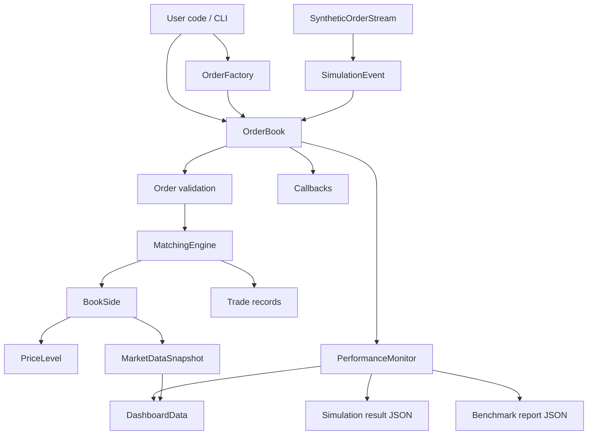
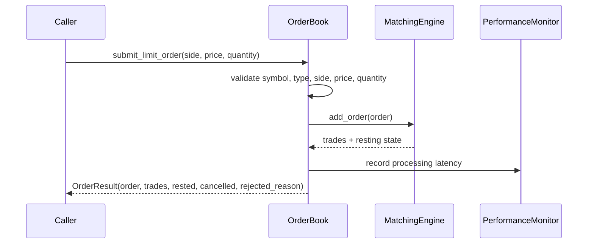

# Architecture

`tracebook` is organized around a small number of auditable components: order construction, book validation, matching, lifecycle events, performance collection, benchmark reporting, and dashboard visualization.

## Component Map

## Core Package Responsibilities

| Path | Responsibility |
| --- | --- |
| `src/tracebook/core/order.py` | `Order`, `Trade`, `OrderSide`, `OrderType`, and `OrderFactory` |
| `src/tracebook/core/orderbook.py` | Public book API, validation, cancellation, replacement, snapshots, callbacks |
| `src/tracebook/core/matching_engine.py` | Coordinates FIFO/pro-rata matching and trade creation |
| `src/tracebook/core/price_level.py` | Price-level storage, depth aggregation, and market data snapshots |
| `src/tracebook/simulation/order_generator.py` | Synthetic order streams and event objects |
| `src/tracebook/simulation/simulation_engine.py` | Multi-symbol simulation loop and lifecycle event injection |
| `src/tracebook/benchmarks/runner.py` | Reproducible scenarios, warmup handling, JSON report writer |
| `src/tracebook/profiling/performance_monitor.py` | Latency, throughput, resource, and overhead collection |
| `src/tracebook/visualization/dashboard.py` | Dash application and demo-simulation wiring |

## Order Lifecycle

Lifecycle event behavior:

| Event | Behavior |
| --- | --- |
| `NEW` | Validates and matches an incoming order |
| `CANCEL` | Removes an active resting order by id when present |
| `REPLACE` | Cancels an active resting order and submits a new limit order with a new id and timestamp |

## Matching Semantics

FIFO:

- Better prices have priority.
- Orders at the same price execute by arrival priority.
- Partial fills preserve the unfilled remainder when the order can rest.

Pro-rata:

- Better prices still have priority.
- Resting orders at a matched price receive allocation based on remaining displayed size.
- Small residual allocation is handled deterministically by the matching path.

Supported order types:

| Type | Resting behavior |
| --- | --- |
| `LIMIT` | May rest when unfilled or partially filled |
| `MARKET` | Executes against available liquidity and never rests |
| `IOC` | Executes immediately and cancels any remainder |
| `FOK` | Executes only when the full quantity is immediately available |

## Measurement Boundaries

Benchmarks intentionally separate several timings:

| Metric | Meaning |
| --- | --- |
| `order_generation_latency_ms` | Synthetic event or order generation time |
| `order_processing_latency_ms` | New-order matching time recorded by the book-processing path |
| `order_event_latency_ms` | Cancellation and replacement event processing time |
| `collection_overhead` | Monitoring overhead sampled by the performance collector |

This prevents a benchmark report from presenting synthetic data generation as matching-engine latency.

## Extension Points

Good first extension areas:

- Add benchmark scenarios in `src/tracebook/benchmarks/runner.py`.
- Add order-flow patterns in `src/tracebook/simulation/order_generator.py`.
- Add result-schema tests in `tests/test_benchmark_runner_json_output.py`.
- Add dashboard charts in `src/tracebook/visualization/dashboard.py`.
- Add matching semantic tests in `tests/test_orderbook_semantics.py`.

Avoid changing public matching behavior without a small executable test that proves the old and new semantics.
