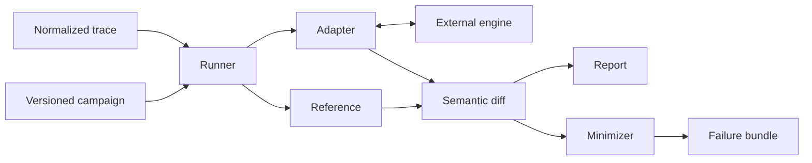
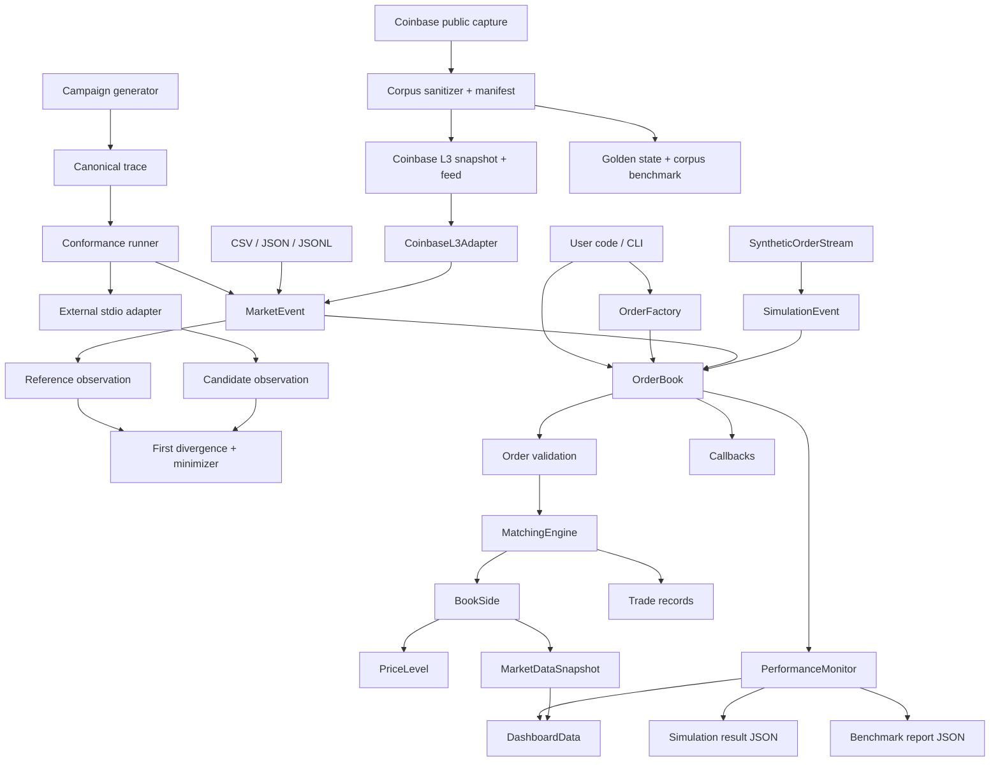
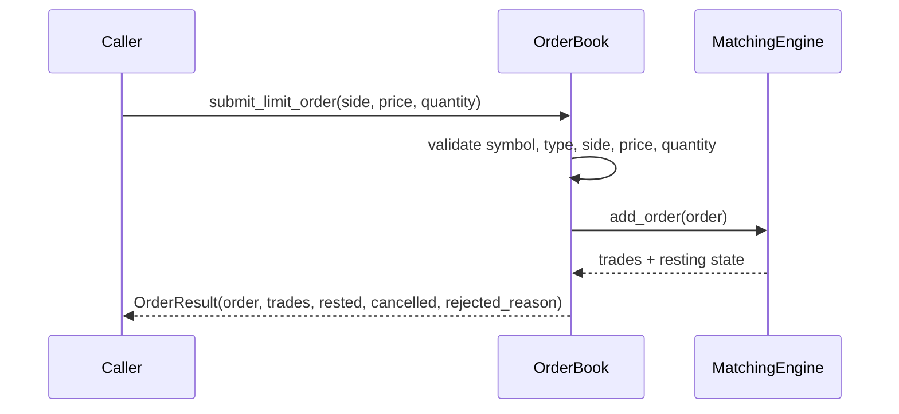

# Architecture

`tracebook` is organized around a small number of auditable components:
canonical event traces, reference matching semantics, external-engine adapters,
semantic comparison and reduction, data replay, performance collection, and
local visualization.

The conformance path has one central contract:

The adapter boundary is a versioned NDJSON stream, so the candidate engine does
not share process memory or implementation code with the reference.

## Component Map

## Core Package Responsibilities

| Path | Responsibility |
| --- | --- |
| `src/tracebook/core/order.py` | `Order`, `Trade`, `OrderSide`, `OrderType`, and `OrderFactory` |
| `src/tracebook/core/orderbook.py` | Public book API, validation, cancellation, priority-preserving reduction, replacement, snapshots, callbacks |
| `src/tracebook/core/matching_engine.py` | Coordinates FIFO/pro-rata matching and trade creation |
| `src/tracebook/core/price_level.py` | Price-level storage, depth aggregation, and market data snapshots |
| `src/tracebook/conformance/model.py` | Versioned config, outcome, trade, queue-state, observation, and hashing contracts |
| `src/tracebook/conformance/campaign.py` | Specified stateful trace generation, multi-trace execution, and atomic failure bundles |
| `src/tracebook/conformance/reference.py` | Incremental adapter over normalized replay and reference matching semantics |
| `src/tracebook/conformance/external.py` | Timeout-bounded external process and NDJSON transport |
| `src/tracebook/conformance/compare.py` | Per-event semantic comparison and exact first-difference reports |
| `src/tracebook/conformance/minimize.py` | Deterministic delta debugging for failing traces |
| `src/tracebook/conformance/reproduce.py` | Exact replay of corpus failures against stored expectations |
| `src/tracebook/conformance/semantic_coverage.py` | Candidate-independent capability evidence from reference observations |
| `src/tracebook/conformance/junit.py` | JUnit projection of canonical conformance JSON artifacts |
| `src/tracebook/conformance/suite.py` | Hash verification, materialization, and execution of standard adversarial cases |
| `integrations/orderbook_rs/` | Native Rust protocol server and semantic adapter over pinned `orderbook-rs` |
| `src/tracebook/simulation/order_generator.py` | Synthetic order streams and event objects |
| `src/tracebook/simulation/simulation_engine.py` | Multi-symbol simulation loop and lifecycle event injection |
| `src/tracebook/events/market_replay.py` | Normalized historical order-event loading and multi-symbol replay |
| `src/tracebook/events/coinbase_l3.py` | Coinbase Exchange L3 snapshot/feed normalization and sequence validation |
| `src/tracebook/corpus/coinbase.py` | Optional public capture, pre-write sanitization, corpus manifests, golden verification, and import benchmarks |
| `src/tracebook/benchmarks/runner.py` | Reproducible scenarios, warmup handling, JSON report writer |
| `src/tracebook/profiling/performance_monitor.py` | Latency, throughput, resource, and overhead collection |
| `src/tracebook/visualization/dashboard.py` | Dash application and demo-simulation wiring |

## Order Lifecycle

Mutation behavior:

| Event | Behavior |
| --- | --- |
| `NEW` | Validates and matches an incoming order |
| `CANCEL` | Removes an active resting order by id when present |
| `REDUCE` | Removes quantity from a resting order without changing its id or queue priority |
| `REPLACE` | Cancels an active resting order and submits a new limit order with a new id and timestamp |
| `CLEAR` | Resets the book and duplicate-id window; recorded explicitly during deterministic replay |

Accepted external orders are normalized into engine-owned objects. Submission
results, lookups, recent trades, and callback payloads are detached copies, so a
consumer cannot mutate the live price-level indexes through the public API.

Normalized file replay treats feed `order_id` values as source identifiers and
maps them to engine ids. The mapping is updated after cancel-and-new replacement,
so later source events continue to address the active replacement. Replay trade
records expose both identifier domains.

## Matching Semantics

FIFO:

- Better prices have priority.
- Orders at the same price execute by arrival priority.
- Partial fills preserve the unfilled remainder when the order can rest.

Pro-rata:

- Better prices still have priority.
- Resting orders at a matched price receive allocation based on remaining displayed size.
- Small residual allocation is handled deterministically by the matching path.

Supported order types:

| Type | Resting behavior |
| --- | --- |
| `LIMIT` | May rest when unfilled or partially filled |
| `MARKET` | Executes against available liquidity and never rests |
| `IOC` | Executes immediately and cancels any remainder |
| `FOK` | Executes only when the full quantity is immediately available |

## Measurement Boundaries

Benchmarks intentionally separate several timings:

| Metric | Meaning |
| --- | --- |
| `order_generation_latency_ms` | Synthetic event or order generation time |
| `order_processing_latency_ms` | New-order matching time recorded by the book-processing path |
| `order_event_latency_ms` | Cancellation and replacement event processing time |
| `collection_overhead` | Monitoring overhead sampled by the performance collector |

Simulation output reports achieved new-order rate separately from total event
rate. Both are paced-workload observations, not unpaced capacity claims.

Corpus benchmarks are a separate local wall-clock model. They bind reports to
one corpus ID and split streaming JSON decode/normalization/replay from replay of
already normalized events. Corpus reports do not flow through
`PerformanceMonitor` and do not claim engine-only latency.

This prevents a benchmark report from presenting synthetic data generation as matching-engine latency.

## Conformance Boundary

The conformance runner is incremental. It sends one normalized event to the
candidate and compares applied/rejected status, stable rejection code, ordered
source-ID trades, resting-order count, and canonical state hash before sending
the next event. A full queue snapshot is transferred only at divergence and at
the end of a successful run.

This keeps protocol traffic linear in event count while retaining exact state
localization. Candidate process execution time is not reported as matching
latency: it includes serialization, pipes, adapter translation, and scheduling.
See `docs/conformance.md` for the protocol and canonical state rules.

Campaign generation runs in a separate reference adapter before comparison. It
uses only canonical reference state to choose valid active orders for lifecycle
operations, then closes that generator-side adapter. Candidate behavior cannot
change future events. Each completed trace is subsequently compared through a
fresh candidate process, and the first divergence is passed to the existing
deterministic minimizer.

## Extension Points

Good first extension areas:

- Add a candidate adapter without changing the reference semantics or protocol.
- Add an adversarial case to the versioned suite with a new fixture hash.
- Add a new versioned campaign profile without changing an existing profile's
  generated traces.
- Add benchmark scenarios in `src/tracebook/benchmarks/runner.py`.
- Add order-flow patterns in `src/tracebook/simulation/order_generator.py`.
- Add result-schema tests in `tests/test_benchmark_runner_json_output.py`.
- Add dashboard charts in `src/tracebook/visualization/dashboard.py`.
- Add matching semantic tests in `tests/test_orderbook_semantics.py`.

Avoid changing public matching behavior without a small executable test that proves the old and new semantics.
