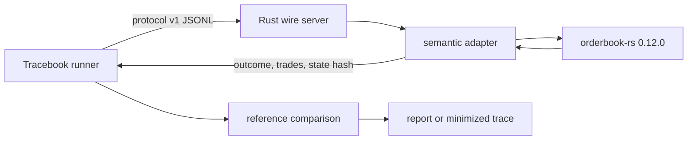

# orderbook-rs Integration

This is a native Rust candidate adapter for the MIT-licensed
[`orderbook-rs`](https://github.com/joaquinbejar/OrderBook-rs) matching engine.
It speaks Tracebook protocol v1 directly over stdin/stdout; the candidate
process does not import or execute Tracebook's Python engine.

The integration pins:

- `orderbook-rs = 0.12.0` (upstream tag commit
  `0e44b5b2334a6878c6a7e57491c4dfb7e2df4d72`)
- `pricelevel = 0.9.1`
- historical `orderbook-rs = 0.8.0` at commit
  `53b4d2b0a657f4260e316d3a8ac3f0df0fc068bf` with `pricelevel = 0.7.0`
  behind the opt-in `historical-issue-88` feature
- Rust `1.88.0` (the first release that compiles upstream's let-chain usage)
- the complete transitive dependency graph in `Cargo.lock`

## Architecture



The shared [`rust_protocol`](../rust_protocol) crate owns framing, protocol
validation, and canonical SHA-256 state serialization. `adapter.rs` owns numeric
conversion, source IDs, owners, lifecycle operations, trade translation, and
complete queue snapshots. `orderbook-rs` performs all matching.

## Run The Proof

From a Tracebook checkout:

```bash
python3 -m pip install -e .

cd integrations/orderbook_rs
cargo build --release --locked
cd ../..

tracebook-conformance run \
  integrations/orderbook_rs/fifo-compatible.jsonl \
  --output /tmp/orderbook-rs-report.json \
  --candidate integrations/orderbook_rs/target/release/tracebook-orderbook-rs
```

The command exits `0` after 13 events and produces:

```json
{
  "candidate_engine": {
    "language": "Rust",
    "name": "orderbook-rs FIFO adapter",
    "version": "0.12.0"
  },
  "compared_events": 13,
  "conformant": true,
  "final_state_hash": "21a9606e7c77c3b239259f5032245c6330ddcd1d3f7fa25394612d9818becee3"
}
```

The trace covers FIFO fills, a decimal partial fill, priority-preserving reduce,
cancel-and-new replace, an inactive cancellation rejection, clear, and multiple
symbols.

## Compatibility Profile

The unmodified engine agrees with seven of Tracebook's nine v2 standard cases:

| Standard case | Result |
| --- | --- |
| `fifo-lifecycle` | Conformant |
| `order-instructions` | Conformant |
| `stp-cancel-resting` | Conformant |
| `stp-cancel-resting-deep` | Expected difference: upstream cancels all same-owner makers at a touched level; Tracebook cancels on encounter |
| `stp-cancel-incoming` | Conformant |
| `multi-symbol` | Conformant |
| `tick-grid` | Conformant |
| `deep-cancellation` | Conformant |
| `pro-rata-allocation` | Expected difference: upstream is FIFO |

Run and retain the complete matrix:

```bash
tracebook-conformance sample /tmp/tracebook-conformance-v2
tracebook-conformance suite \
  /tmp/tracebook-conformance-v2 \
  --output /tmp/orderbook-rs-suite.json \
  --candidate integrations/orderbook_rs/target/release/tracebook-orderbook-rs
```

The suite exits `1` for two explicit contract differences: pro-rata is
unsupported, and native `CancelMaker` cancels every same-owner maker at a
touched level before matching while Tracebook's FIFO policy cancels makers only
as the sweep reaches them. The maintained workflow asserts the exact `7/9`
profile, suite ID, and four-event STP divergence.

The broader generated gate exercises all FIFO instructions:

```bash
tracebook-conformance campaign \
  --output-dir /tmp/orderbook-rs-campaign \
  --profile fifo-full-v1 \
  --seed 20260713 \
  --traces 10 \
  --events-per-trace 100 \
  --candidate integrations/orderbook_rs/target/release/tracebook-orderbook-rs
```

That deterministic 1,000-event campaign is conformant with campaign ID
`sha256:95c3dac9d27b770a5cccebe9ff16b6e71af443001d633b640983f02f3e04b3c9`.

## Historical Real-Defect Proof

Flash's
[`matching-engine-benchmark`](https://github.com/flash1-dev/matching-engine-benchmark)
found a real partial-fill priority defect and reported it as
[`orderbook-rs` #88](https://github.com/joaquinbejar/OrderBook-rs/issues/88).
The affected lower-level queue moved a partially filled head maker's remainder
to the tail. Upstream fixed it in
[`orderbook-rs` PR #131](https://github.com/joaquinbejar/OrderBook-rs/pull/131).

Build the exact historical revision through the same adapter source:

```bash
cargo build --release --locked \
  --no-default-features \
  --features historical-issue-88 \
  --bin orderbook-rs-issue-88-adapter
```

Then generate, detect, and minimize the real defect:

```bash
tracebook-conformance campaign \
  --profile fifo-partial-fill-v1 \
  --seed 42 \
  --traces 1000 \
  --events-per-trace 200 \
  --max-minimize-runs 200 \
  --candidate-cmd ./target/release/orderbook-rs-issue-88-adapter \
  --corpus-dir .tracebook/corpus \
  --stop-after-first
```

The first trace diverges at event 173 with 10/10 semantic capabilities covered.
Tracebook reduces it to four events and identifies
`$.observation.trades[0].sell_order_id`: FIFO expects maker `9100000001`, while
the affected engine consumes maker `9100000002`. The campaign ID is
`sha256:e8e158af0223b4e61dbb7efeab10cfd1b34b0d3b478b3e086c12bea008c0b4aa`
and the failure ID is `failure-7dd023c684cdb2d0fc0e`.

The reduced trace is committed at
[`regressions/issue-88-reduced.jsonl`](regressions/issue-88-reduced.jsonl). The
maintained 0.12.0 candidate passes it. See the
[full provenance and reduction case study](../../docs/case-studies/orderbook-rs-issue-88.md).

### Direct Flash Artifact Handoff

Flash later merged candidate canonical-output export and a schema-v1 offline
comparator in
[`matching-engine-benchmark` PR #4](https://github.com/flash1-dev/matching-engine-benchmark/pull/4).
Running that boundary against the affected graph identifies canonical sequence
`15738`. Tracebook's bounded
[`flash_benchmark` bridge](../flash_benchmark) converts the corresponding
15,739-message binary prefix and minimizes it in 193 runs.

The one-minimal result preserves Flash's actual workload values in
[`regressions/flash-issue-88-reduced.jsonl`](regressions/flash-issue-88-reduced.jsonl):
two buys rest at 33532, a crossing sell partially fills the older maker, and a
later sell IOC exposes the affected queue consuming the newer maker first. The
historical adapter reports queue-priority drift; 0.12.0 conforms.

This direct import and the event-173 generated campaign are independent traces
of the same defect. Their distinct sequence numbers are retained rather than
collapsed into one claim.

## Intentionally Faulty Engine

The same Cargo project also builds `faulty-orderbook-adapter`, a separate binary
whose source is [`src/bin/faulty_orderbook_adapter.rs`](src/bin/faulty_orderbook_adapter.rs).
It uses the real native engine and wire protocol but injects one documented
defect: after a maker is reduced and replaced, the next crossing order in the
structured probe book can match using the maker's stale FIFO priority.

```bash
tracebook-conformance campaign \
  --profile fifo-limit-v1 \
  --seed 42 \
  --traces 1000 \
  --events-per-trace 200 \
  --candidate-cmd ./integrations/orderbook_rs/target/release/faulty-orderbook-adapter \
  --corpus-dir .tracebook/corpus \
  --stop-after-first
```

This synthetic negative control exits `1` at original event 173, identifies queue-priority drift, and
reduces the failure to the five causal events. The correct
`tracebook-orderbook-rs` binary conforms on that reduced trace. The maintained
workflow pins both results, making the reduced JSONL a real CI regression case.

The correct binary also retains `--test-fault=drop-first-trade` as a smaller
protocol negative control. It is not the public demonstration.

All Rust source, the real four-event regression, `Cargo.toml`, `Cargo.lock`, and
`rust-toolchain.toml` are included in the public Tracebook sdist. Build
artifacts under `target/` are excluded.

## Translation Contract

- Source IDs map to `orderbook-rs` sequential IDs and must fit in `u64`.
- Prices reproduce Tracebook's binary64 division followed by ties-to-even tick
  rounding, are stored as integer ticks, and return as canonical decimal
  strings. This is intentionally not exact decimal division at half-tick
  boundaries; for example, `1.015 / 0.01` snaps to `1.01`.
- Quantities use fixed-point `u64` units at `quantity_decimal_places`; a value
  that rounds to zero or overflows that range is rejected.
- Real owners map deterministically to `Hash32`. Anonymous owners receive a
  unique per-order identity so STP does not make unrelated anonymous orders
  self-match or reject them for a missing user ID.
- `CANCEL_RESTING` maps to `CancelMaker`; `CANCEL_INCOMING` maps to
  `CancelTaker`. `CancelMaker` removes all same-owner makers at every touched
  level, so the deeper-maker v2 case is a documented semantic difference from
  Tracebook's cancel-on-encounter reference policy.
- Reduction only decreases the remaining quantity. It uses native
  `UpdateQuantity`, which keeps the existing insertion sequence for a decrease.
- Replacement is translated as validated cancel-and-new, preserving the source
  ID and owner while losing queue priority. This explicit sequence is
  load-bearing: native `OrderUpdate::Replace` validates first and may retain the
  original order when replacement admission fails.
- Every symbol receives a stable UUID-v5 trade-ID namespace through
  `with_clock_and_namespace`. Native trade IDs are deterministic across equal
  command streams, but protocol v1 compares portable source-order fills rather
  than candidate-private trade IDs.
- Symbols are independent books, sorted in canonical snapshots.

## External Validation

The `orderbook-rs` maintainer reviewed this adapter in
[issue #203](https://github.com/joaquinbejar/OrderBook-rs/issues/203). They
confirmed that native quantity decreases retain FIFO position, replacement is
cancel-and-add and always loses priority, maker/taker IDs are faithful, and the
adapter's queue view matches consumption order for `fifo-limit-v1`.

The review promoted the priority contract into public docs and property tests in
[`orderbook-rs` PR #204](https://github.com/joaquinbejar/OrderBook-rs/pull/204)
and exposed a snapshot-round-trip defect tracked in
[`orderbook-rs` #205](https://github.com/joaquinbejar/OrderBook-rs/issues/205).
The lower-level repair landed in
[`PriceLevel` PR #110](https://github.com/joaquinbejar/PriceLevel/pull/110).

In a follow-up on the same issue, the maintainer tested the adapter end to end
against `orderbook-rs 0.12.0` and `pricelevel 0.9.1`. This graph materializes
level snapshots in queue-consumption order even after an in-place upsize
demotes an order. Tracebook independently locks both observations in one native
test: the snapshot reports the demoted order at the tail and the next trade
consumes the order shown first.

The versioned generated profiles still exclude in-place upsize. They decrease
in place and model replacement as cancel-and-new, so adding upsize requires a
new capability-profile version and portable regression rather than changing
existing trace hashes.

The same external review also found the deeper-maker `CANCEL_RESTING`
difference now locked in `tracebook-conformance-v2` and tracked in
[Tracebook issue #57](https://github.com/Taz33m/tracebook/issues/57). This is a
contract distinction, not an upstream defect: both engines execute the trade
against order 2, but only Tracebook leaves the unencountered order 3 resting.

This adapter tests behavior, not latency. Its process timing includes JSON,
pipes, translation, snapshots, and OS scheduling.

## CI

The maintained, copyable workflow is
[`../../.github/workflows/orderbook-rs.yml`](../../.github/workflows/orderbook-rs.yml).
Its core Rust gate is:

```yaml
- uses: dtolnay/rust-toolchain@1.88.0
  with:
    components: rustfmt, clippy
- run: cargo fmt --check
- run: cargo clippy --locked --all-targets -- -D warnings
- run: cargo test --locked
- run: cargo build --release --locked
```

When adapting another Rust engine, retain `wire.rs`, replace the native calls in
`adapter.rs`, update engine metadata and the compatibility matrix, then keep the
fixed trace, generated campaign, and negative control as three separate gates.
Candidate stdout is reserved for protocol frames; diagnostics belong on stderr.
